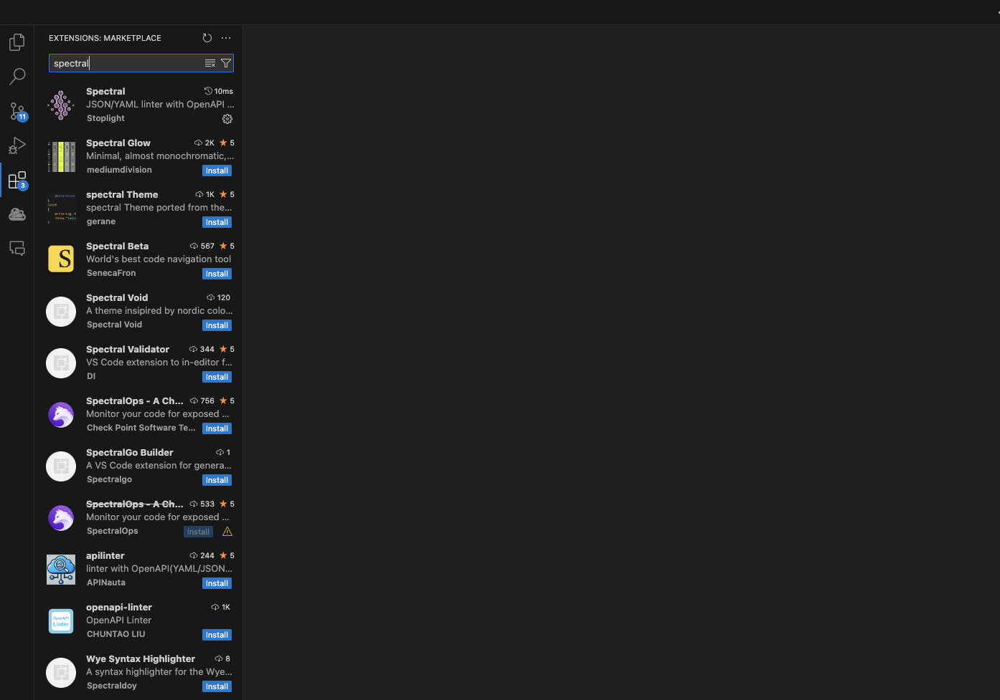
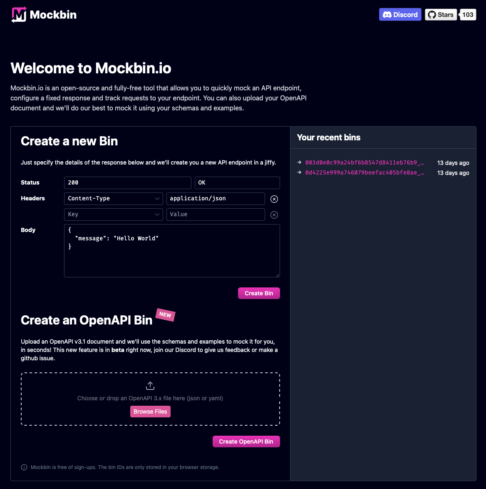
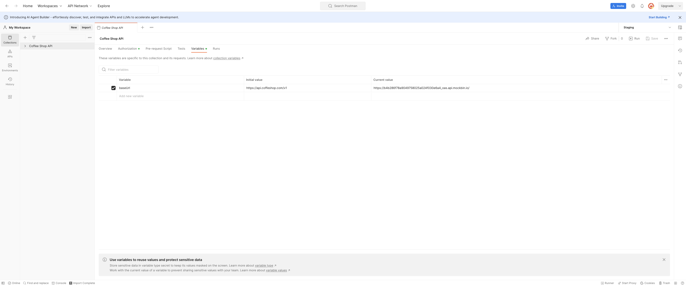
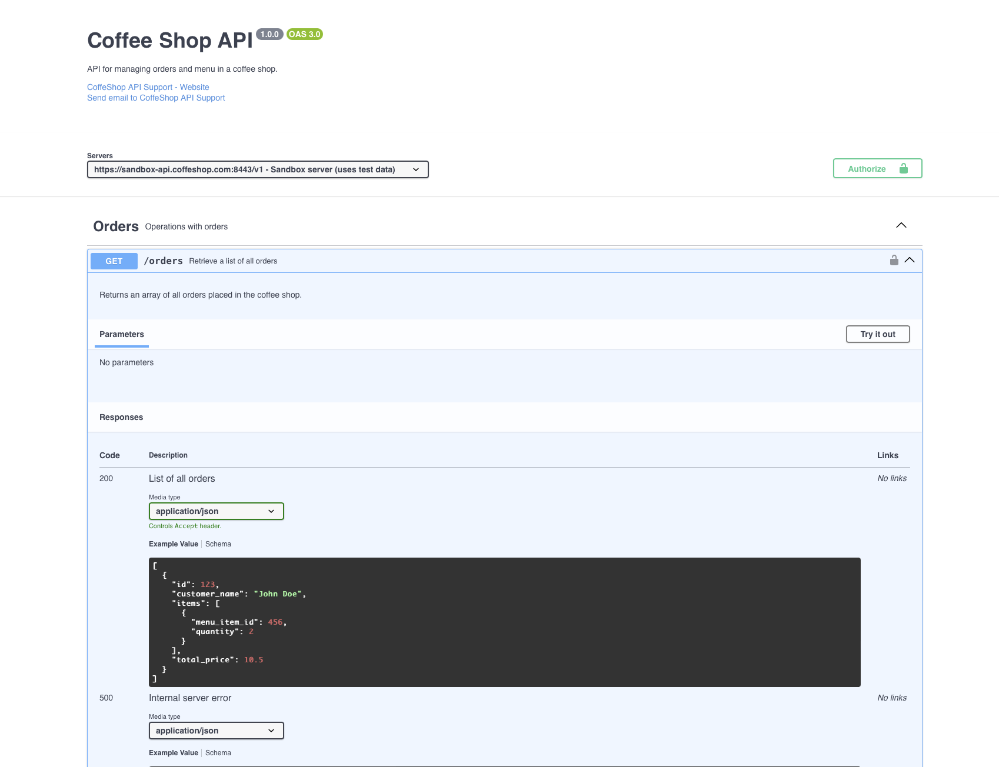

# oas_course_tester
Set of materials for tester OAS course


# Presentation:
[CSAS_tester.pdf](https://drive.google.com/file/d/1YeKFbugLc_i7XBJJVNeVEBYbpDEFoUr5/view?usp=sharing)


# Practical excercises

This section is divided into 4 sections:
 - JSON Schema - basic of JSON Schema exercises
 - OpenAPI Basics - basics of OpenAPI exercises
 - Using OpenAPI Schema in practice - using OpenAPI Schema in practice 

 ### Used tools:

 - [VSCode](https://code.visualstudio.com/) - IDE - you can use any other IDE you want but you won't be able to use Spectral extension. You can use [OpenAPI Editor](https://editor-next.swagger.io) as an alternative (If you don't have any IDE).
 - [Spectral](https://spectral.stoplight.io/) - OpenAPI linter and formatter used as extension in VSCode
 
  
 
 - [OpenAPI Editor](https://editor-next.swagger.io) to edit, mock and test OpenAPI Schema
 
**Optional (if you have access to it):**
 - [Mockbin](https://mockbin.io/) to create mock server from OpenAPI Schema
 - [Postman](https://www.postman.com/) to test OpenAPI Schema


## 1. JSON Schema

Open API Schema is based on JSON Schema. So, we will start with the basics of JSON Schema. This part can be done in **single** YAML file. **Start by creating a new file with `.yaml` extension**.

Useful links and resources:

[Understanding JSON Schema](https://json-schema.org/understanding-json-schema/basics.html)

[jsonschema.net](https://jsonschema.net/) to create JSON Schemas from JSON objects. Another useful tool is [json-to-yaml](https://jsonformatter.org/json-to-yaml) to convert JSON Schema to YAML. Also most of the modern LLMs can generate JSON Schema from natural language. Feel free to use any tools you want but make sure that **you understand the schema you are creating**.

### 1.1 Basic JSON Schema

Given the following JSON object representing a menu item:

```json
{
  "id": 456,
  "name": "Cappuccino",
  "description": "A delicious cappuccino made with our finest espresso.",
  "price": 3.50
}
```
Create a JSON Schema that describes JSON object with the following properties:

**`id`**: required attribute, integer

**`name`**: required attribute, string, minimum length of 3, maximum length of 50

**`description`**: optional attribute, string, maximum length of 100, nullable

**`price`**: required attribute, number, minimum value of 0

**Objective:**

Learn to define a JSON Schema for describing a simple JSON object representing a menu item. Result should be valid JSON Schema with type `object` and all the required attributes, title, descriptions, examples. Basic structure should look like this:

```yaml
# Specifies the version of JSON Schema being used
$schema: "https://json-schema.org/draft/2020-12/schema"

# Title and description provide metadata about the schema
title: "MenuItem"
description: "A schema representing a menu item."

# Indicates that the data should be an object
type: "object"

# Defines the properties of the object
properties:
  # Property 1
  property1:
    # Property type (string, number, boolean, object, array)
    type: "string"
    # Property description
    description: "Description of property 1"
    # Property example value should be valid for the property type
    example: "Example value"
# Defines that the object is required to have the following properties
required:
  - property1
  - property2
```

**Result:**

[1_result.yaml](JSON_schema/1_result.yaml)

### 1.2 JSON Schema - enums and simple arrays

Building upon the `MenuItem` schema from Exercise 1.1, extend the schema to include the following:

- **`size`**: An optional attribute that specifies the size of the menu item. It should be a string with one of the following values: "Small", "Medium", "Large". Default value should be "Medium".

- **`extraItems`**: An optional array that lists additional items that can be added to the menu item. Each element in the array should be a string representing the name of the extra item. The array can be empty and can have maximum 5 elements.

**Example JSON Object:**

```json
{
  "id": 456,
  "name": "Cappuccino",
  "description": "A delicious cappuccino made with our finest espresso.",
  "price": 3.50,
  "size": "Medium",
  "extraItems": ["Extra Shot"]
}
```

**Objective:**

Learn how to enhance an existing JSON Schema by adding enumerated values (enum) and arrays, ensuring that the new properties adhere to specified constraints.

Enums are defined set of values that can be used for a property.

```yaml
type: "object"
properties:
  # Enum values
  enumProperty:
    type: "string"
    default: "value2"
    enum:
      - "value1"
      - "value2"
      - "value3"
```

Array is defined as a list of values.

```yaml
type: "object"
properties:
  arrayProperty:
    type: "array"
    minItems: 0
    maxItems: 500
    items:
      # definition of the item in the array
```
**Result:**

[2_result.yaml](JSON_schema/2_result.yaml)

### 1.3 JSON Schema - complex arrays

Building upon the `MenuItem` schema from Exercise 1.2, extend the schema to include a `modifiers` property. This property allows customization of the menu item with various options.

**Requirements:**

**`modifiers`**:
   - **Type**: Array of objects
   - **Each object**:
     - **`name`**:
       - **Type**: String
       - **Description**: The name of the modifier (e.g., "Milk Type", "Syrup Flavor")
       - **Required**: Yes
     - **`options`**:
       - **Type**: Array of strings
       - **Description**: A list of possible options for this modifier (e.g., ["Whole Milk", "Skim Milk", "Soy Milk"])
       - **Items**:
         - **Type**: String
       - **Minimum Items**: 1
       - **Unique Items**: True
       - **Required**: Yes

**Example JSON Object:**

```json
{
  "id": 456,
  "name": "Cappuccino",
  "description": "A delicious cappuccino made with our finest espresso.",
  "price": 3.50,
  "size": "Medium",
  "extraItems": ["Extra Shot"],
  "modifiers": [
    {
      "name": "Milk Type",
      "options": ["Whole Milk", "Skim Milk", "Soy Milk"]
    },
    {
      "name": "Syrup Flavor",
      "options": ["Vanilla", "Caramel", "Hazelnut"]
    }
  ]
}
```

**Objective:**

Learn how to enhance an existing JSON Schema by adding complex arrays, ensuring that the new properties adhere to specified constraints.

Unique items are used to ensure that the items in the array are unique.

```yaml
type: "object"
properties:
  arrayProperty:
    type: "array"
    items:
      type: "object"
      properties:
        firstProperty:
          type: "string"
        secondProperty:
          type: "string"
      required:
        - firstProperty
        - secondProperty
    uniqueItems: true
```

**Result:**

[3_result.yaml](JSON_schema/3_result.yaml)

### 1.4 JSON Schema - oneOf

Building upon the `MenuItem` schema from Exercise 1.3, enhance the schema to include a `promotion` property that can represent different types of promotions applied to a menu item. Utilize the `oneOf` keyword to define validation rules for the promotion types.

**Requirements:**

1. **`promotion`** (optional):
   - **Type**: Object
   - **Description**: Details of the promotion applied to the menu item.
   - **Validation**:
     - **`oneOf`**: The `promotion` object must match exactly one of the following schemas:
       - **Discount Promotion**:
         - **Properties**:
           - `type`: Must be the string `"discount"`.
           - `amount`: A number representing the discount amount.
         - **Required**: `type`, `amount`
       - **Buy One Get One Free Promotion**:
         - **Properties**:
           - `type`: Must be the string `"bogo"`.
           - `description`: A string describing the promotion.
         - **Required**: `type`, `description`

**Example JSON Object:**

```json
{
  "id": 456,
  "name": "Cappuccino",
  "description": "A delicious cappuccino made with our finest espresso.",
  "price": 3.50,
  "size": "Medium",
  "extraItems": ["Extra Shot", "Soy Milk"],
  "modifiers": [
    {
      "name": "Milk Type",
      "options": ["Whole Milk", "Skim Milk", "Soy Milk"]
    },
    {
      "name": "Syrup Flavor",
      "options": ["Vanilla", "Caramel", "Hazelnut"]
    }
  ],
  "promotion": {
    "type": "discount",
    "amount": 1.00
  }
}
```

**Objective:**

Learn how to enhance an existing JSON Schema by adding a `promotion` property that can represent different types of promotions applied to a menu item. Utilize the `oneOf` keyword to define validation rules for the promotion types.

oneOf is used to define validation rules for the promotion types.

```yaml
type: "object"
properties:
  # Property that can be one of the following schemas
  propertyThatCanBeOneOf:
    oneOf:
      # First oneOf schema
      - type: "object"
        properties:
          firstProperty:
            type: "string"
          secondProperty:
            type: "string"
        required:
          - firstProperty
          - secondProperty
      # Second oneOf schema
      - type: "object"
        properties:
          firstProperty:
            type: "string"
          secondProperty:
            type: "string"
```
**Result:**

[4_result.yaml](JSON_schema/4_result.yaml)


## 2. OpenAPI Basics

This section is divided into 5 exercises, all of them should be done in single YAML file. You should start from [start_here.yaml](OAS_basics/start_here.yaml) file. This file is already prepared with some of the components defined to help you with the OAS structure and syntax. 

**Useful links:**
[OAS reference](https://swagger.io/specification/v3/) - this is the official reference for OpenAPI Specification. It will be useful when you will need to check the syntax of the OpenAPI Specification.


### 2.1. Define reusable Order component

Coffee Shop API by defining a reusable Order component that standardizes the structure of customer orders.

**Requirements:**

- Define the Order Schema
The Order object should represent a customer's order, including:
  - **`id`** (integer, read-only): Unique order ID
  - **`customer_name`** (string, 3-50 characters): Name of the customer
  - **`items`** (array of OrderItem objects): List of ordered items
  - **`total_price`** (number, float): Total price of the order

- Define the OrderItem Schema
The OrderItem object should represent an individual item in an order, including:
  - **`menu_item_id`** (integer): Reference to a menu item
  - **`quantity`** (integer): Number of times this item was ordered

**Example JSON Object:**

```json
{
  "id": 123,
  "customer_name": "John Doe",
  "items": [
    {
      "menu_item_id": 456,
      "quantity": 2
    },
    {
      "menu_item_id": 789,
      "quantity": 1
    }
  ],
  "total_price": 10.50
}

```

**Objective:**
Enhance the existing specification by adding a new component `Order` and `OrderItem`.

**Result:**

[1_result.yaml](OAS_basics/1_result.yaml)

### 2.2. Add endpoint for listing all orders

**Objective:**

Extend the Coffee Shop API by adding a new endpoint that allows users to retrieve a list of all orders. This will help in managing and reviewing orders efficiently.

**API Specification:**
 - **New Endpoint:** List All Orders
 - **Path:** /orders
 - **Method:** GET
 - **Tag:** Orders
 - **Summary:** Retrieve a list of all orders.
 - **Description:** Returns an array of orders placed in the coffee shop.
 - **Operation ID:** getOrders

**Request Parameters:**
 - This endpoint does not require any request parameters.

**Responses:**
- 200 OK - Response Schema: Array of orders
- 500 Internal Server Error

**Result:**

[2_result.yaml](OAS_basics/2_result.yaml)

### 2.3 Add endpoint for deleting order by id

The Coffee Shop API currently supports retrieving orders but lacks an endpoint for deleting an order by its ID. This task involves adding a new DELETE /orders/{orderId} endpoint to allow clients to delete an order from the system.

**Requirements:**
- **Path:** /orders/{orderId}
- **HTTP Method:** DELETE
- **Tags:** Orders
- **Summary:** Delete an order by its ID
- **Description:** Removes an order from the coffee shop system using the provided orderId.
- **Operation ID:** deleteOrderById

**Request Parameters:**
- **Path Parameter:**
  - orderId (integer, required)
  - Description: The unique identifier of the order to be deleted.
  - Example: 123

**Responses:**
- 204 OK with empty response body
- 404 Not Found
- 500 Internal Server Error

**Objective:**
Add a new endpoint for deleting an order by its ID.

**Result:**

[3_result.yaml](OAS_basics/3_result.yaml)

### 2.4 Add endpoint for creating new order

Enhance the Coffee Shop API by adding a new endpoint for creating a new order. This endpoint should allow users to submit an order with details such as customer name, items ordered, and total price.

**Objective:**
 - Add a new endpoint for creating a new order, it has the same requirements as previous exercise.

 **Request Body:**
 - Required: true
 - Content-Type: application/json
 - Schema:
   - `Order` object

 **Responses:**
   - 201 (Created) - Returns ID of the created order
   - 400 (Bad Request)
   - 500 (Internal Server Error)

**Result:**

[4_result.yaml](OAS_basics/4_result.yaml)

### 2.5 Add endpoint for updating order by id

The Coffee Shop API currently supports retrieving, creating, and deleting orders. However, it lacks an endpoint to update an existing order by its ID. This task involves adding a `PUT /orders/{orderId}` endpoint to update an order's details.  

**Method**: `PUT`
**Path**: `/orders/{orderId}`
**Description**: Updates an order's details using the provided `orderId`.

**Path Parameter**:
  - `orderId` (integer, required): The ID of the order to be updated.

**Request Body**:
- The request body must contain an updated `Order` object.

**Responses**  
- 200 OK – Order updated successfully. Returns updated object
- 404 Not Found – Order not found. Returns an error object
- 500 Internal Server Error – Server error. Returns an error object

**Result:**

[5_result.yaml](OAS_basics/5_result.yaml)


## 3. Using OpenAPI Schema in practice

### Mockbin:

You can use Mockbin to create mock server from OpenAPI Schema, it will generate mock server running on public URL. You can use it to test your API before it is implemented.

  

### Postman:

Use Postman to test OpenAPI Schema. You can use it to import OpenAPI Schema and call endpoints. In setup you can use environment variables to switch between different environments (use URL from Mockbin).

  

### OpenAPI Editor:

Use OpenAPI Editor to edit OpenAPI Schema. You can use it to edit OpenAPI Schema, mock server and test API.

  
